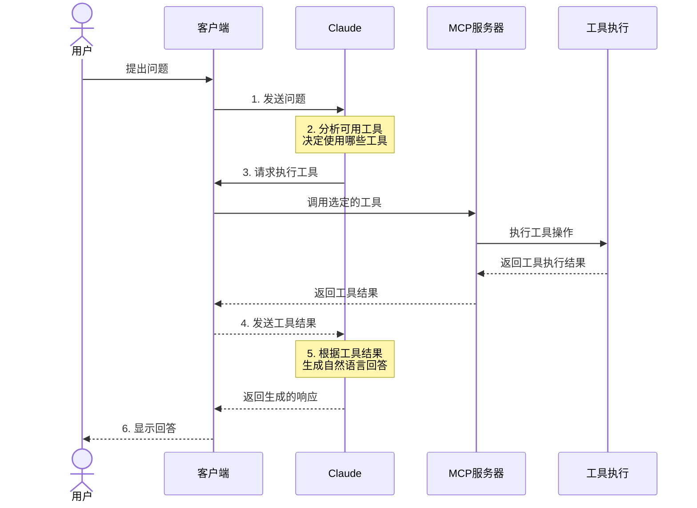
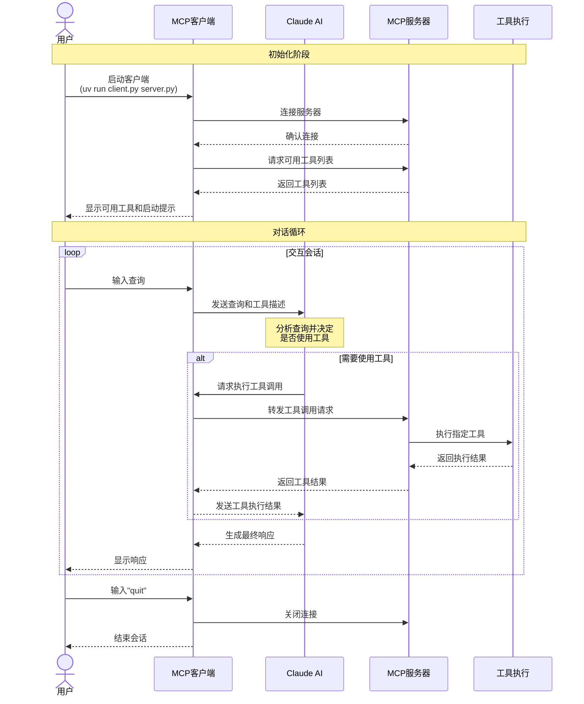

---
{"dg-publish":true,"permalink":"/MCP 初探/","noteIcon":"default"}
---


1. 什么是 MCP？

MCP 就是一种 LLM 能够识别的协议。为了增强 LLM 的能力而生。如何增强它的能力？本质就是让其他服务、工具按照这个通用协议实现一些功能，然后让 LLM 调用。
因为在有 MCP 之前，LLM 只能做一些在它的训练数据集范围之内的事情，后面即使有了联网搜索能力，但它能做的事情还是有限。比如我想让他帮我打开邮箱服务，发送邮件，它肯定做不到，最起码一点它无法与邮箱客户端进行交流。当有了 MCP 协议, 根据这个协议，实现一个服务，其内部可以调用邮箱服务的接口进行发送、接收邮件。然后把这个服务暴露给 LLM, 之后再跟它进行聊天时，可以直接触发发送邮件服务。


以 Claude desktop 为例：



上述的客户端即为 Claude Desktop, 也可以是 Cursor。它们的后端对应着 LLM。这里容易混淆。比如用户使用 cursor ，输入问题，cursor 客户端调用远程的 LLM 服务。然后它发现有可用的工具，并且与用户输入的需求匹配，那么它就会返回客户端，客户端此时就能决定使用哪个工具。
于是向 MCP 服务器发送请求。服务器里面定义了一系列工具，此时会选定某个工具，并执行。之后将执行结果返回，一直返回到客户端，客户端让LLM 把结果进行一定的语言重新组织，然后输出给客户端，此时就是用户在客户端（Claude Desktop）上看到的信息。


客户端需要知道 mcp 服务器定义在哪，以及如何调用并运行。常见的是使用 command 进行调用。这样有两种方式：
1. json 配置文件：
```json
{
    "mcpServers": {
        "weather": {
            "command": "uv",
            "args": [
                "--directory",
                "D:\\WORK\\AI_workstation\\weather",
                "run",
                "weather.py"
            ]
        }
        "other server": {
            "command": "uv",
            "args": [
                "--directory",
                "path to the server file dir",
                "run",
                "server script"
            ]
        }
    }
}
```
> Claude Desktop 的配置文件是 `claude_desktop_config.json`

该配置文件就是一个 json 对象，key 就是 “mcpServers",  上面的例子就是在告诉外界，在哪里以及如何运行 weather.py 这个 mcp 服务。

2. 另外一种方式就是直接写出命令行，比如在 cursor 中 MCP Servers 的配置可以是这样：`cmd /k npx -y @smithery/cli@latest run @wopal/mcp-server-hotnews --config {1,2,3}`
它等效于在配置文件 `.cursor/mcp.json` 这样写：
```json
{
    "mcpServers": {
      "@wopal-mcp-server-hotnews": {
        "command": "cmd /k npx",
        "args": [
          "-y",
          "@smithery/cli@latest",
          "run",
          "@wopal/mcp-server-hotnews",
          "--config",
          "{1,2,3}"
        ]
      }
    }
}
```


配置完成后，可以看到有可用的 MCP 工具：

	

2. 如何搭建个人 mcp server

可以在这里找：

- https://smithery.ai/
- https://github.com/punkpeye/awesome-mcp-servers
- https://github.com/modelcontextprotocol/servers

3. 搭建 mcp Client

比较复杂





参考： https://modelcontextprotocol.io/introduction