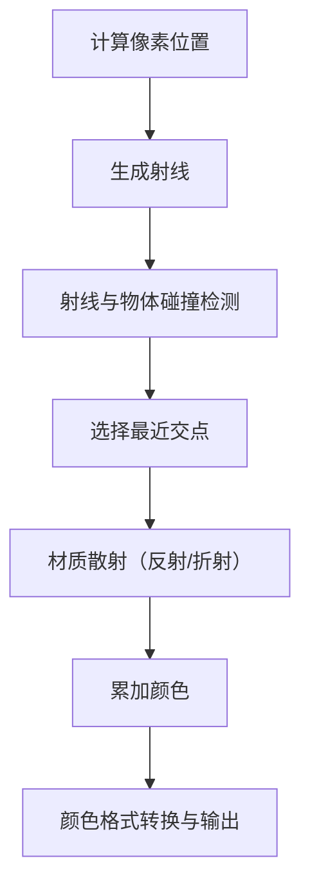

---
{"dg-publish":true,"permalink":"/光线追踪原理/","noteIcon":"1"}
---


首先理解这三件事：

1. 人的眼睛能看到东西，是因为光从物体上反射进入到人眼，根据光线可逆性，我们可以把这个过程"想象"是由于人的眼睛发出光，投射到物体上，于是物体被看见了。现在，基于这个概念，用一条直线，带有方向，来模拟人眼，就称为 ray 线吧，即射线。


2. 数学知识：平面有两个点：O点，P点，O 点固定，P 点运动，但是 P 点的运动受到约束：$$ (P_x-O_x)^2 + (P_y-O_y)^2 = r^2 $$    那么 P 点的运动轨迹肯定是一个平面圆。三维的立体圆也一样。


3. 如果 ray 向空间任意方向发射光线，再假设存在一个完全透明的立体球（此时完全看不见），当 ray 线与它相交(交点为1，在表面，交点为2，穿过内部)，这个时候将交点以及交点内部都涂色，是不是马上就能看见这个立体球了？只需要满足约束：$$ (P_x-O_x)^2 + (P_y-O_y)^2 + (P_z-O_z)^2 = r^2 $$ 即可。这其实就渲染出来了一个 3D 的球体。


好了，理解了这个就理解了光线追踪最基本的知识，然后你就能画出如下的图了：


### 基础

好了，先从最基本的来，打好基础，把框架做好。以下都是基于三维坐标进行构建的。

---
#### 1. 如何表示图片?
这里使用 **PPM** 图片格式， 其最简单的内容如下：
```text
P3
# 注释
3 2
255
255   0   0     0 255   0     0   0 255
255 255   0   255 255 255     0   0   0
```

- 首行为"P3"，表示是ASCII格式的PPM文件
- "3 2"表示图像尺寸为宽3像素、高2像素(像素点的表达使用 RGB，如(255,0,0)表示红点)
- "255"表示最大颜色值
- 随后6组RGB数值表示6个像素的颜色值

所以实际图片显示如下：

<svg width="300" height="200" xmlns="http://www.w3.org/2000/svg">
<rect x="0" y="0" width="100" height="100" fill="rgb(255,0,0)" stroke="black" stroke-width="1" />
<rect x="100" y="0" width="100" height="100" fill="rgb(0,255,0)" stroke="black" stroke-width="1" />
<rect x="200" y="0" width="100" height="100" fill="rgb(0,0,255)" stroke="black" stroke-width="1" />
<rect x="0" y="100" width="100" height="100" fill="rgb(255,255,0)" stroke="black" stroke-width="1" />
<rect x="100" y="100" width="100" height="100" fill="rgb(255,255,255)" stroke="black" stroke-width="1" />
<rect x="200" y="100" width="100" height="100" fill="rgb(0,0,0)" stroke="black" stroke-width="1" />
</svg>

---

#### 2. 数学基础

***射线***
前面提到的 ray 射线，在空间中满足：
$$ \mathbf{P}(t) = \mathbf{A} + t\mathbf{b} $$


其中:
- $\mathbf{P}(t)$ 是射线上任意一点的位置向量
- $\mathbf{A}$ 是射线起点
- $\mathbf{b}$ 是射线的单位方向向量
- $t$ 是参数，表示从起点沿方向行进的距离

如果要展示具体的分量形式，可以写作：

$$ \begin{bmatrix} P_x(t) \\ P_y(t) \\ P_z(t) \end{bmatrix} = 
   \begin{bmatrix} A_x \\ A_y \\ A_z \end{bmatrix} + 
   t\begin{bmatrix} b_x \\ b_y \\ b_z \end{bmatrix} $$


涉及到向量以及矩阵，但是不需要深究，代码实现起来也不难理解。现在只需要明白几个知识点即可。

射线又可以分为：
1. 视线射线(View Ray):
<svg width="500" height="300" xmlns="http://www.w3.org/2000/svg">
<!-- 相机 -->
<circle cx="50" cy="150" r="10" fill="black"/>
<text x="20" y="180" font-size="14">相机</text>
<!-- 图像平面 -->
<line x1="100" y1="100" x2="100" y2="200" stroke="blue" stroke-width="2"/>
<text x="85" y="90" font-size="14">图像平面</text>
<!-- 场景物体 -->
<circle cx="300" cy="120" r="30" fill="#aaaaaa" stroke="black"/>
<rect x="250" y="180" width="60" height="60" fill="#dddddd" stroke="black"/>
<!-- 主射线 -->
<line x1="50" y1="150" x2="100" y2="120" stroke="red" stroke-width="1.5" stroke-dasharray="5,2"/>
<line x1="100" y1="120" x2="270" y2="120" stroke="red" stroke-width="1.5"/>
<line x1="50" y1="150" x2="100" y2="150" stroke="red" stroke-width="1.5" stroke-dasharray="5,2"/>
<line x1="100" y1="150" x2="300" y2="150" stroke="red" stroke-width="1.5"/>
<line x1="50" y1="150" x2="100" y2="180" stroke="red" stroke-width="1.5" stroke-dasharray="5,2"/>
<line x1="100" y1="180" x2="250" y2="180" stroke="red" stroke-width="1.5"/>
<text x="150" y="110" font-size="14" fill="red">主射线</text>
</svg>

主射线是从相机/观察点(view point)发出，穿过图像平面上的每个像素，用于确定该像素"看到"的场景内容。这些射线决定了哪些物体会出现在最终渲染的图像中。

2. 阴影射线(Shadow Ray)

<svg width="500" height="350" xmlns="http://www.w3.org/2000/svg">
<!-- 相机和主射线 -->
<circle cx="50" cy="150" r="10" fill="black"/>
<line x1="50" y1="150" x2="250" y2="150" stroke="red" stroke-width="1.5"/>
<text x="20" y="180" font-size="14">相机</text>
<!-- 物体 -->
<rect x="250" y="120" width="60" height="60" fill="#dddddd" stroke="black"/>
<circle cx="400" cy="200" r="30" fill="#aaaaaa" stroke="black"/>
<!-- 光源 -->
<circle cx="400" cy="50" r="15" fill="yellow" stroke="orange" stroke-width="2"/>
<text x="390" y="30" font-size="14">光源</text>
<!-- 交点 -->
<circle cx="250" cy="150" r="5" fill="blue"/>
<text x="230" y="140" font-size="14">交点</text>
<!-- 阴影射线 -->
<line x1="250" y1="150" x2="400" y2="50" stroke="gray" stroke-width="1.5" stroke-dasharray="5,2"/>
<text x="300" y="80" font-size="14" fill="gray">阴影射线</text>
<!-- 反射射线 -->
<line x1="250" y1="150" x2="200" y2="100" stroke="green" stroke-width="1.5"/>
<text x="180" y="90" font-size="14" fill="green">反射射线</text>
<!-- 折射射线 -->
<line x1="250" y1="150" x2="310" y2="180" stroke="purple" stroke-width="1.5"/>
<text x="310" y="170" font-size="14" fill="purple">折射射线</text>
</svg>

阴影射线又叫次级射线，它是从物体表面的交点发出，用于计算光照、阴影、反射和折射等效果。主要包括：
- 阴影射线：从交点指向光源，判断是否被遮挡
- 反射射线：根据反射定律计算，用于渲染镜面反射
- 折射射线：穿透透明物体，产生折射效果


***点乘***

向量 **a** 和 **b** 的**点乘(dot)**，表示如下：
$$ \mathbf{a} \cdot \mathbf{b} = a_x b_x + a_y b_y + a_z b_z = |\mathbf{a}||\mathbf{b}|\cos\theta $$

对应的矩阵表达方式是：
$$ \mathbf{a} \cdot \mathbf{b} = \begin{bmatrix} a_x & a_y & a_z \end{bmatrix} \begin{bmatrix} b_x \\ b_y \\ b_z \end{bmatrix} $$


***点乘的几何意义：**
- 结果是一个标量
- 等于向量b的长度乘以向量a在向量b方向上的投影长度(反过来也一样)
- $\mathbf{a} \cdot \mathbf{b} = |\mathbf{a}||\mathbf{b}|\cos\theta$
- 反映两向量方向的相似度：
	- 正值：夹角＜90°（方向相似）
	- 零值：夹角=90°（垂直）
	- 负值：夹角＞90°（方向相反）


***叉乘***

对于向量 $\mathbf{a}$ 和 $\mathbf{b}$，**叉乘(cross)**可以表示为：

$$ \mathbf{a} \times \mathbf{b} = \begin{vmatrix} 
\mathbf{i} & \mathbf{j} & \mathbf{k} \\
a_x & a_y & a_z \\
b_x & b_y & b_z
\end{vmatrix} $$

展开后得到：

$$ \mathbf{a} \times \mathbf{b} = \begin{pmatrix}
a_y b_z - a_z b_y \\
a_z b_x - a_x b_z \\
a_x b_y - a_y b_x
\end{pmatrix} $$


叉乘的几何意义：
1. 结果是一个向量，且垂直于 $\mathbf{a}$ 和 $\mathbf{b}$ 
2. 方向遵循右手定则
3. 模长等于 $|\mathbf{a}||\mathbf{b}|\sin\theta$
4. 等于由两向量构成的平行四边形的面积
5. 常用于计算法向量


用代码表示如下：
```c++ vec3.h
// 省略其他代码

using point3 = vec3;

// 点乘
inline double dot(const vec3& u, const vec3& v) {
    return u.e[0] * v.e[0]
        + u.e[1] * v.e[1]
        + u.e[2] * v.e[2];
}

// 叉乘
inline vec3 cross(const vec3& u, const vec3& v) {
    return vec3(
        u.e[1] * v.e[2] - u.e[2] * v.e[1],
        u.e[2] * v.e[0] - u.e[0] * v.e[2],
        u.e[0] * v.e[1] - u.e[1] * v.e[0]
    );
}
// 单位向量
inline vec3 unit_vector(const vec3& v) {
    return v / v.length();
}
```


ray 射线的表达：
```c++ ray.h
#ifndef RAY_H
#define RAY_H

#include "vec3.h"
class ray {
  public:
	// ray 的构造函数
    ray() {}
    ray(const point3& origin, const vec3& direction) : orig(origin), dir(direction) {}

	// 原点以及方向
    const point3& origin() const  { return orig; }
    const vec3& direction() const { return dir; }
	// 当前的位置表达: p_at = orig + t*dir
    point3 at(double t) const {
        return orig + t*dir;
    }

  private:
    point3 orig;
    vec3 dir;
};

#endif
```


#### 3. 空间坐标
现在假设有一个相机，它是射线的出发点，作为原点，坐标是(0,0,0)。然后还需要一个屏幕，这里我们叫做 viewport , 但是它也是虚拟的，是由像素矩阵组成的，对应着我们能看到的图像的平面。它们目前的关系如下：


回到像素矩阵平面，其坐标如下：


这里要区分视口原点 Q，像素原点P(0,0)，它们的坐标是不一样的。

现在使用代码来实现这些坐标，如下：

```c++
    auto aspect_ratio = 16.0 / 9.0;  // 设置长宽比，可调整
    int image_width = 400;           // 图像宽度

    // 根据图像宽度，计算图像高度
    int image_height = int(image_width / aspect_ratio);
    image_height = (image_height < 1) ? 1 : image_height;

    // 相机

	// 相机原点到视口中心点的垂直距离
    auto focal_length = 1.0;
    // viewport 的 高度
    auto viewport_height = 2.0;
    // 根据 viewport的高度，计算其宽度
    auto viewport_width = viewport_height * (double(image_width)/image_height);
    // 相机中心点
    auto camera_center = point3(0, 0, 0);

    // viewport 的 U，V 方向坐标
    auto viewport_u = vec3(viewport_width, 0, 0);
    auto viewport_v = vec3(0, -viewport_height, 0);

    // Calculate the horizontal and vertical delta vectors from pixel to pixel.
    // viewport 上面的像素点间的距离(u，v 方向根据 viewport 的宽和高来分别计算)
    auto pixel_delta_u = viewport_u / image_width;
    auto pixel_delta_v = viewport_v / image_height;

    // Calculate the location of the upper left pixel.
    // 计算得到左上角 Q 点的坐标
    auto viewport_upper_left = camera_center
                             - vec3(0, 0, focal_length) - viewport_u/2 - viewport_v/2;
    // 计算得到起始像素点的坐标(P(0,0)点)
    auto pixel00_loc = viewport_upper_left + 0.5 * (pixel_delta_u + pixel_delta_v);
```


有了相机中心点，viewport的左上角的点，和像素的第一个点(扫描所有像素点时，从左到右，从上到下，因此左上角是起点)

```c++
	// 按行从左到右扫描
    for (int j = 0; j < image_height; j++) {
	    // 从上到下扫描列
        for (int i = 0; i < image_width; i++) {
		    // 每次扫描时的像素点坐标
            auto pixel_center = pixel00_loc + (i * pixel_delta_u) + (j * pixel_delta_v);
            // ray 射线方向，由相机中心点指向像素点
            auto ray_direction = pixel_center - camera_center;
            // 因此获得 ray 射线
            ray r(camera_center, ray_direction);
			// 射线所扫描到的点，使用ray_color 进行着色
            color pixel_color = ray_color(r);
            // 着色后，写入图像
            write_color(std::cout, pixel_color);
        }
    }

color ray_color(const ray& r) {
    return color(0,0,0);
}
```


#### 4. 渲染
前面已经完成部分代码，以下是主代码:
```c++
#include "color.h"
#include "ray.h"
#include "vec3.h"
#include <iostream>

color ray_color(const ray& r) {
    return color(0,0,0);
}

int main() {

    // Image

    auto aspect_ratio = 16.0 / 9.0;
    int image_width = 400;

    int image_height = int(image_width / aspect_ratio);
    image_height = (image_height < 1) ? 1 : image_height;

    // Camera

    auto focal_length = 1.0;
    auto viewport_height = 2.0;
    auto viewport_width = viewport_height * (double(image_width)/image_height);
    auto camera_center = point3(0, 0, 0);

    auto viewport_u = vec3(viewport_width, 0, 0);
    auto viewport_v = vec3(0, -viewport_height, 0);

    auto pixel_delta_u = viewport_u / image_width;
    auto pixel_delta_v = viewport_v / image_height;

    auto viewport_upper_left = camera_center
                             - vec3(0, 0, focal_length) - viewport_u/2 - viewport_v/2;
    auto pixel00_loc = viewport_upper_left + 0.5 * (pixel_delta_u + pixel_delta_v);

    // Render

    std::cout << "P3\n" << image_width << " " << image_height << "\n255\n";

    for (int j = 0; j < image_height; j++) {
        std::clog << "\rScanlines remaining: " << (image_height - j) << ' ' << std::flush;
        for (int i = 0; i < image_width; i++) {
            auto pixel_center = pixel00_loc + (i * pixel_delta_u) + (j * pixel_delta_v);
            auto ray_direction = pixel_center - camera_center;
            ray r(camera_center, ray_direction);

            color pixel_color = ray_color(r);
            write_color(std::cout, pixel_color);
        }
    }

    std::clog << "\rDone.                 \n";
}
```

渲染的关键部分在于，获得 ray 射线后：
```c++
	// 获得 ray 射线
	ray r(camera_center, ray_direction);
	// 对射线所指向的点进行着色，即渲染
	color pixel_color = ray_color(r);
	// 着色后写入图像文件
	write_color(std::cout, pixel_color);

color ray_color(const ray& r) {
	//目前 渲染的点都为(0,0,0) 即为黑色
    return color(0,0,0);
}
```
结果如下：


为了渲染其他颜色，需要更改 ray_color 的逻辑。这里我们想先做一个简单的渐变效果。

有一种方法叫做**线性混合** 或 **线性插值**： $$ f(a) = (1-a) \cdot v_0 + a \cdot v_1 $$
其图像是：
<svg width="400" height="300" xmlns="http://www.w3.org/2000/svg">
<!-- 坐标轴 -->
<line x1="50" y1="250" x2="350" y2="250" stroke="black" stroke-width="2" />
<line x1="50" y1="50" x2="50" y2="250" stroke="black" stroke-width="2" />
<!-- 坐标轴标签 -->
<text x="360" y="250" font-size="16">a</text>
<text x="30" y="40" font-size="16">值</text>
<!-- 坐标刻度 -->
<text x="45" y="270" font-size="14">0</text>
<text x="345" y="270" font-size="14">1</text>
<!-- startValue和endValue标签 -->
<text x="10" y="290" font-size="14">startValue</text>
<text x="10" y="100" font-size="14">endValue</text>
<!-- 插值直线 -->
<line x1="50" y1="250" x2="350" y2="100" stroke="red" stroke-width="3" />
<!-- 辅助线 -->
<line x1="50" y1="100" x2="350" y2="100" stroke="gray" stroke-width="1" stroke-dasharray="5,5" />
<line x1="50" y1="250" x2="350" y2="250" stroke="gray" stroke-width="1" stroke-dasharray="5,5" />
<!-- 几个插值点的示例 -->
<circle cx="50" cy="250" r="5" fill="blue" />
<circle cx="125" cy="212.5" r="5" fill="blue" />
<circle cx="200" cy="175" r="5" fill="blue" />
<circle cx="275" cy="137.5" r="5" fill="blue" />
<circle cx="350" cy="100" r="5" fill="blue" />
<!-- a=0.25, 0.5, 0.75的标记 -->
<text x="125" y="200" font-size="12">a=0.25</text>
<text x="200" y="160" font-size="12">a=0.5</text>
<text x="275" y="125" font-size="12">a=0.75</text>
</svg>
应用到代码中是这样：
```c++
color ray_color(const ray& r) {
    vec3 unit_direction = unit_vector(r.direction());
    auto a = 0.5*(unit_direction.y() + 1.0);
    return (1.0-a)*color(1.0, 1.0, 1.0) + a*color(0.5, 0.7, 1.0);
}
```
所有图片变成渐变了：


#### 5. 渲染球体
根据前面的数学知识，我们已经知道了绘制一个想象中的球体是如何了。假设我们要在 viewport 中心处渲染处这个球体，目前球的中心点已知，ray 射线也已知，那么只剩下解方程了。
$$ \mathbf{P}(t) = \mathbf{A} + t\mathbf{b} $$
$$(C_x - x)^2 + (C_y - y)^2 + (C_z - z)^2 = r^2$$
> P=(x,y,z)到中心 C=(Cx,Cy,Cz) 的向量是 (C−P), 那么球的表明方程为：(C−P)⋅(C−P)=r2

 
> 
求球根公式是：
$$x = \frac{-b \pm \sqrt{b^2 - 4ac}}{2a}$$
当它无解时，表明 ray 射线与其不相交，当存在一个根时，表示想切，存在两个根，表示相交并穿过(不过这在现在的场景下与一个根区别不大)。

```c++
// 判断 ray 射线是否碰撞到球体
bool hit_sphere(const point3& center, double radius, const ray& r) {
	// C-Q
    vec3 oc = center - r.origin();

	// 简化后的求根公式的系数分解
    auto a = dot(r.direction(), r.direction());
    auto b = -2.0 * dot(r.direction(), oc);
    auto c = dot(oc, oc) - radius*radius;

	// 判断 b2 - 4ac 的大小
    auto discriminant = b*b - 4*a*c;
    大于或等于 0 时，说明有根，因此射线 ray 与球体相交。
    return (discriminant >= 0);
}

color ray_color(const ray& r) {
	// 球体的中心点为(0,0,-1), 即在 Z 轴方向上距相机原点(0,0,0) 1 个单位距离。半径 0.5，
    if (hit_sphere(point3(0,0,-1), 0.5, r))
	    // 当与球体相交时，渲染为红色
        return color(1, 0, 0);
	// 其余情况，保持渐变
    vec3 unit_direction = unit_vector(r.direction());
    auto a = 0.5*(unit_direction.y() + 1.0);
    return (1.0-a)*color(1.0, 1.0, 1.0) + a*color(0.5, 0.7, 1.0);
}
```


结果如预期一样，渲染出了一个球体，从想象中透明的球体变为可见的了。

#### 6. 球体表面法线着色

球体表面的法线即为垂直于表面的一条线，在坐标系中它位于从球心指向表面交点的方向。

刚才我们使用 ray 射线进行着色，现在使用球体表面法线进行着色。


代码如下：
```c++
double hit_sphere(const point3& center, double radius, const ray& r) {
    vec3 oc = center - r.origin();
    auto a = dot(r.direction(), r.direction());
    auto b = -2.0 * dot(r.direction(), oc);
    auto c = dot(oc, oc) - radius*radius;
    auto discriminant = b*b - 4*a*c;

    if (discriminant < 0) {
        return -1.0;
    } else {
	    // 求最小根，即离相机原点最近的交点。
        return (-b - std::sqrt(discriminant) ) / (2.0*a);
    }
}

color ray_color(const ray& r) {
    auto t = hit_sphere(point3(0,0,-1), 0.5, r);
    if (t > 0.0) {
	    // 当存在最小根时，计算法线，并将之转换为单位向量。 t.at(t)即为球体表面交点 
        vec3 N = unit_vector(r.at(t) - vec3(0,0,-1));
        // 将法线每个分量的范围缩放到[0,1]  （N.x() 最大是1个单位）
        // 这也产生一种平滑的渐变效果
        return 0.5*color(N.x()+1, N.y()+1, N.z()+1);
    }

    vec3 unit_direction = unit_vector(r.direction());
    auto a = 0.5*(unit_direction.y() + 1.0);
    return (1.0-a)*color(1.0, 1.0, 1.0) + a*color(0.5, 0.7, 1.0);
}
```
于是球体也有了渐变色：


### 后续

用下面的示意图总结一下整个渲染流程的核心步骤：



后面还有对交点附近的点进行抗锯齿处理、表面漫反射处理、折射处理，以及根据不同材料表面的反射情况做不同的处理等等更复杂的处理，时间有限，这样就先不写了，后面有时间再继续写。有兴趣可以看参考链接。


### 参考链接：
1. https://raytracing.github.io/books/RayTracingInOneWeekend.html